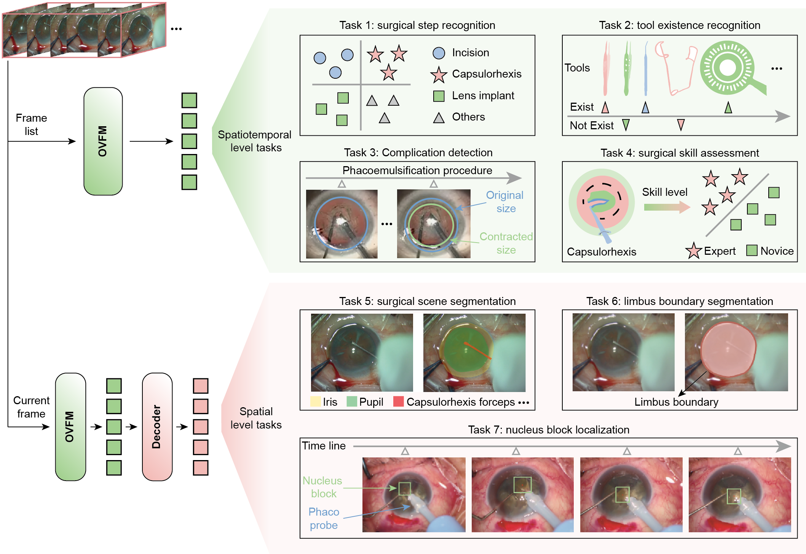

# OVFM: Ophthalmic Video Foundation Model for Surgical Recognition and Navigation

---

## 🎯 Overview

OVFM is a comprehensive foundation model designed for understanding ophthalmic surgical videos. The model supports multiple downstream tasks including:

- 🔍 Surgical Step Recognition
- 🔧 Tool Existence Recognition
- ⚠️ Complication Detection
- 📊 Surgical Skill Assessment
- 🎨 Surgical Scene Segmentation
- 🎯 Limbus Boundary Segmentation
- 📍 Nucleus Block Localization

<div align="center">
    <a href="https://"></a>
</div>

---

## 🚀 Installation

Create the conda environment using the provided configuration:

```bash
conda env create -f environment.yaml
conda activate ovfm
```

---

## 📊 Dataset Preparation

### Pretraining Data

#### Step 1: Video Compression

Compress original videos using FFmpeg for efficient storage:

```bash
python data/pretrain/video_compression.py
```

**Configuration:**
- `src_main_folder`: Path to original videos
- `dst_main_folder`: Path to save compressed videos
- `ffmpeg_path`: Path to `ffmpeg.exe`

> 💡 **Note:** Install FFmpeg from [https://www.ffmpeg.org/](https://www.ffmpeg.org/)

#### Step 2: Generate Video Clips

Downsample surgical videos into clips:

```bash
python data/pretrain/generate_video_clips.py
```

**Configuration:**
- `input_folders`: List all compressed video paths

#### Step 3: Generate Training Index

Create the pretraining index file:

```bash
python data/pretrain/generate_pretraining_csv.py
```

This generates `train.csv` containing video clip path indices.

### Downstream Task Data

Detailed data preparation instructions for each downstream task are provided in the [Downstream Tasks](#-downstream-tasks) section.

---

## 🎓 Pretraining

### Download Pretrained Weights

Download the initial pretrained weights:

```bash
# Download from: https://github.com/kahnchana/svt/releases/download/v1.0/kinetics400_vitb_ssl.pth
# Place in: checkpoints/kinetics400_vitb_ssl.pth
```

### Start Pretraining

Choose the appropriate model size:

**OVFM Base Model:**
```bash
bash scripts/pretrain_train_base.sh
```

**OVFM Small Model:**
```bash
bash scripts/pretrain_train_small.sh
```

**OVFM Tiny Model:**
```bash
bash scripts/pretrain_train_tiny.sh
```

> 📦 **Pretrained Models:** Download our pretrained OVFM weights from [Google Drive](https://drive.google.com/file/d/1YTfYzjUhuRGpZEwajIU1nsec4in_EaRL/view?usp=drive_link)

---

## 🔬 Downstream Tasks

### 4.1 Surgical Step Recognition

**Dataset Setup:**

Create three folders under `data/downstream/`:
- `Aier_Cata`
- `Cataract101`
- `Xinhua_Cata`

For each dataset:
1. Place resized video frames in `data_resize_phase_recognition/[video_id]/`
2. Place label data in `phase_annotations_phase_recognition/video[video_id].csv`

**Data Preparation:**

```bash
# Aier_Cata dataset
python data/downstream/step_recognition/Aier_Cata/generate_video_paths_and_label.py

# Cataract101 dataset
python data/downstream/step_recognition/Cataract101/generate_video_paths_and_label.py

# Xinhua_Cata dataset
python data/downstream/step_recognition/Xinhua_Cata/generate_video_paths_and_label.py
```

**Fine-tuning:**

```bash
bash scripts/Finetune_step_recognition.sh
```

---

### 4.2 Tool Existence Recognition

**Dataset Setup:**

1. Place downsampled video frames in:
   ```
   data/downstream/surgical_tool_existence_recognition/data_resize/
   ```

2. Place label files in:
   ```
   data/downstream/surgical_tool_existence_recognition/label/
   ```

**Data Preparation:**

```bash
python data/downstream/surgical_tool_existence_recognition/generate_paths.py
```

**Fine-tuning:**

```bash
bash scripts/Finetune_tool_existence.sh
```

---

### 4.3 Complication Detection

**Dataset Setup:**

Place videos in:
```
data/downstream/complication_detection/videos/
```

**Data Preparation:**

```bash
python data/downstream/complication_detection/generate_train_and_test.py
```

**Fine-tuning:**

```bash
bash scripts/Finetune_complication_detection.sh
```

---

### 4.4 Surgical Skill Assessment

**Dataset Setup:**

Place videos in:
```
data/downstream/surgical_skill_assessment/videos/
```

**Data Preparation:**

```bash
python data/downstream/surgical_skill_assessment/generate_train_and_test.py
```

**Fine-tuning:**

```bash
bash scripts/Finetune_skill_assesement.sh
```

---

### 4.5 Surgical Scene Segmentation

**Dataset Setup:**

Place Cataract dataset scene segmentation data in:
```
data/downstream/surgical_scene_segmentation/Images-and-Supervisely-Annotations/
```

**Data Preparation:**

```bash
python data/downstream/surgical_scene_segmentation/Translate_into_label_images.py
python data/downstream/surgical_scene_segmentation/generate_train_test_path.py
```

**Fine-tuning:**

```bash
python Downstream_tasks/Downstream_scene_segmentation/train.py
```

---

### 4.6 Limbus Boundary Segmentation

**Dataset Setup:**

Create dataset folders:
```
data/downstream/segmentation/Cataract101/
data/downstream/segmentation/Xinhua_Cata/
```

For each dataset:
- Place video frames in: `data_resize_feature_extractor/`
- Place labels in: `segmentation_labels_test_path/`

**Data Preparation:**

```bash
# For Cataract101
python data/downstream/segmentation/Cataract101/generate_train_test_path.py

# For Xinhua_Cata
python data/downstream/segmentation/Xinhua_Cata/generate_train_test_path.py
```

**Fine-tuning:**

```bash
python Downstream_tasks/Downstream_limbus_segmentation/train.py
```

---

### 4.7 Nucleus Block Localization

**Dataset Setup:**

Create folder:
```
data/downstream/nucleus_tracking/frames_with_json_labels/
```

Place all video frames and corresponding `.json` annotation files in this folder.

**Data Preparation:**

```bash
python data/downstream/necleus_tracking/generate_labels_and_visualization.py
python data/downstream/necleus_tracking/split_dataset.py
```

**Fine-tuning:**

```bash
bash scripts/Finetune_nucleus_tracking.sh
```

---

## 🎯 Knowledge Distillation

To perform knowledge distillation for OVFM:

```bash
bash scripts/distillation.sh
```

---

## 🙏 Acknowledgements

This project builds upon the excellent work of:

- [SVT](https://github.com/kahnchana/svt) - Self-supervised Video Transformer
- [Endo-FM](https://github.com/med-air/Endo-FM) - Foundation Model for Endoscopy Video Analysis

We thank the authors for their valuable contributions to the community.

